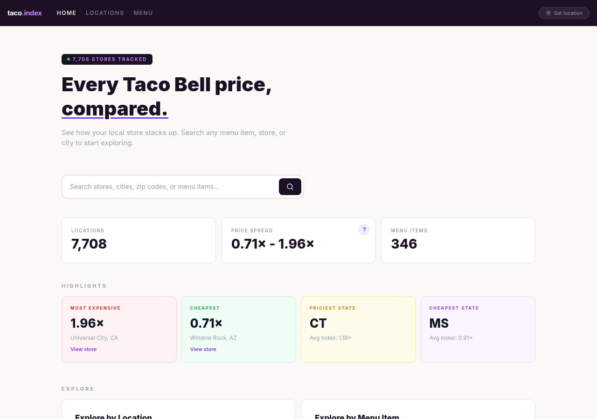

# taco.index

> Every Taco Bell price, compared.

Track and compare menu prices across **7,700+ Taco Bell locations** in the United States. See how your local store stacks up — search any menu item, store, or city to start exploring.

## Features

- **Price comparison** across every US Taco Bell location
- **Price index** showing how each store compares to the national average (0.71x to 1.96x spread)
- **Search** by store, city, zip code, or menu item
- **Location explorer** with interactive map, drive-thru and breakfast filters
- **Menu browser** with nutrition data and price ranges per item
- **State-level rankings** for cheapest and most expensive regions

## Data

Pricing data is scraped from Taco Bell's public ordering API. The dataset covers all menu items available for online ordering at each location. Prices are updated regularly.

Not affiliated with Taco Bell Corp.

## Live Site

**[jaedync.github.io/taco-index](https://jaedync.github.io/taco-index)**
